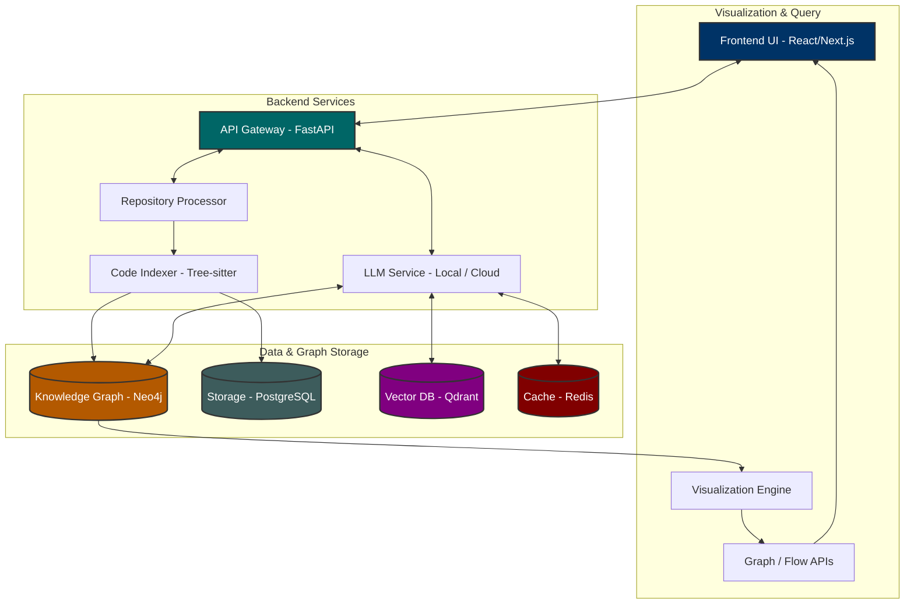
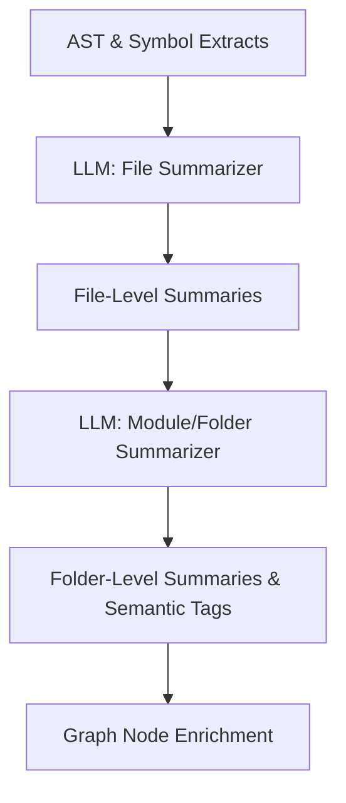
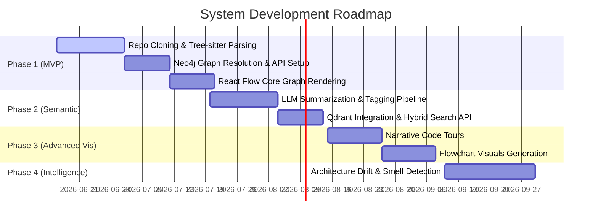

# AI Codebase Architecture Visualizer

An interactive, map-like system for exploring and understanding software architecture using static analysis, knowledge graphs, and selective local/cloud LLM semantic summarization.

---

## 1. System Overview & Philosophy

### Core Philosophy
The platform operates on a **Static Analysis First, LLM Enhancement Second** philosophy. We divide architectural understanding into three distinct layers:

| Layer | Purpose | Technology / Engine |
| :--- | :--- | :--- |
| **Structural Layer** | Raw code analysis, symbol boundaries, import mapping | Tree-sitter, GitPython, Dependency Resolution |
| **Semantic Layer** | LLM-powered context, purpose abstraction, tagging | GPT-4/Claude, Local Models (Ollama), Vector Embeddings |
| **Visual Layer** | Interactive exploration, zoomable system maps, code flows | Next.js, React Flow, Cytoscape.js, Zustand |

Rather than functioning as a traditional IDE (which focuses on localized file editing), the system is built as a **"Google Maps for software systems"**, enabling developers to navigate from global module clusters down to individual function execution flows.

---

## 2. High-Level Architecture



---

## 3. Tech Stack Specification

### Frontend
- **Framework:** Next.js (React)
- **Styling:** TailwindCSS + Framer Motion (micro-animations)
- **Medium/Standard Graphs:** React Flow (highly interactive node-based maps)
- **Large Graphs (1,000+ nodes):** Cytoscape.js (efficient rendering of massive dependency trees)
- **State Management:** Zustand
- **Client Search:** FlexSearch (for fast browser-side index lookups)

### Backend
- **API Framework:** FastAPI (Asynchronous Python)
- **Task Runner:** Celery (handles heavy, async ingestion and indexing operations)
- **Message Broker & Cache:** Redis
- **Git Engine:** GitPython
- **Code Parser:** Tree-sitter (multi-language grammar libraries)
- **Relational Storage:** PostgreSQL
- **Graph Storage:** Neo4j
- **Vector Index:** Qdrant

### AI & Embeddings
- **Summarization & High Abstraction:** GPT-4 / Claude (for module summaries and tours)
- **General Semantic Embeddings:** `text-embedding-3-large`
- **Code Symbol Embeddings:** `jina-embeddings-v2-base-code` (code-optimized semantic vector searches)
- **Local/Cheap Summaries:** Local LLMs via Ollama (e.g., DeepSeek Coder, Mistral, Phi-3 mini)

---

## 4. Repository Ingestion Pipeline

### Step 1: Clone Repository
Backend exposes `POST /api/repository/import` taking `{"repo_url": "https://github.com/user/project"}`. Using `GitPython`, the system clones the repository to a isolated local path.

### Step 2: Auto-Detect Project Type
Scans codebase root for identifiers:
- `package.json` $\rightarrow$ Node.js / TypeScript / Monorepos
- `requirements.txt` / `pyproject.toml` $\rightarrow$ Python
- `Cargo.toml` $\rightarrow$ Rust
- `pom.xml` / `build.gradle` $\rightarrow$ Java
- `go.mod` $\rightarrow$ Go

### Step 3: Build File Tree
Constructs a flat database hierarchy matching directory structure:
```json
{
  "id": "src/auth/login.ts",
  "type": "file",
  "parent": "src/auth"
}
```

### Step 4: Parse Code with Tree-sitter
Deterministic parser extracts:
- File imports and exports
- Class names, decorators, and declarations
- Function signatures, methods, parameters, and return statements
- Local variable scopes and AST nodes

### Step 5: Resolve Dependency Graph
Maps relations between files based on import trees and symbol usages, creating edges:
```json
{
  "from": "src/auth/login.ts",
  "to": "src/db/connection.ts",
  "type": "IMPORTS"
}
```

---

## 5. Knowledge Graph Design (Neo4j)

### Node Schema
- `Repository`: Root repository meta-information.
- `Folder`: Directories organizing code layout.
- `File`: Source code files.
- `Class`: Code structures containing methods and fields.
- `Function`: Functional units, constructors, and procedures.
- `APIEndpoint`: Web API routes (e.g., `POST /login`).
- `DatabaseTable`: Database schemas/tables mapped from models/ORMs.
- `Service`: Logical module aggregates.

### Relationship Types
- `IMPORTS`: Target file is imported by source.
- `CALLS`: Source function executes target function.
- `EXTENDS` / `IMPLEMENTS`: OOP inheritance mapping.
- `DEPENDS_ON`: High-level dependency between packages.
- `ROUTES_TO`: Web route resolves to a handler function.
- `READS` / `WRITES`: Code interaction with `DatabaseTable` or persistence entities.

---

## 6. LLM Abstraction Layer

To avoid excessive token usage and prevent hitting context boundaries, **raw files are never sent wholesale to LLMs**. Instead, we feed the LLM a structured digest:

```
[Target File / Context Code]
  ├── Imports & Exports
  ├── Function Signatures & Class Interfaces
  ├── AST Snippets & Docstrings
  └── Neighboring File Summary Context
```

### Hierarchical Processing Workflow


- **File-Level Summary Output:** Plain-English responsibilities, key functions, critical dependencies.
- **Folder-Level Summary Output:** High-level description of module interactions (e.g., Stripe API integration flow).
- **Semantic Tags:** Generates machine-readable classification tags (`["authentication", "database", "queue-processing"]`) to power UI clustering, search indexing, and graph pruning.

---

## 7. Interactive Visual Modes

### Mode 1: Dependency Graph (Macro View)
- **Engine:** Cytoscape.js
- **Capabilities:** Displays global imports, folder clusters, and module bonds. Includes cluster collapse, semantic coloring, layer-filtering, and dynamic zoom/pan.

### Mode 2: Flowchart View (Meso View)
- **Engine:** React Flow
- **Capabilities:** Renders control-flow diagrams (e.g., API request pipelines) derived from function call chains and route mappings. Does not execute code runtime.

### Mode 3: Narrative Code Tours (Micro View)
- **Concept:** Guides developers step-by-step through a logical workflow (e.g., *"How a user signs up"*).
- **Format:** Chronological list of steps, where clicking a step highlights the respective file/function on the visual map and opens the semantic summary.

---

## 8. Frontend UI Layout

Our UI mimics spatial canvas platforms (like Figma or Excalidraw) instead of text-heavy IDEs:

```
+-------------------------------------------------------------+
| Top Navigation (Search Repository, Search Query, Status)    |
+------------------------------+------------------------------+
|                              |                              |
|   Conceptual File Browser    |   Interactive System Map     |
|   - Folders as Roles         |   (React Flow / Cytoscape)   |
|   - File Importance Indicators|                              |
|                              |                              |
+------------------------------+------------------------------+
| AI Summary Panel                                            |
| - Selected Node Explanations, Related Flows, Dependencies   |
+-------------------------------------------------------------+
```

---

## 9. Performance & Security Strategies

- **Incremental Parsing:** Only run Tree-sitter parser and update Neo4j nodes for files whose git hashes have changed.
- **Chunked Analysis:** Batch repository tasks into distinct directory chunks to avoid overloading memory.
- **Caching Layer:** Store pre-computed layout coordinates, embeddings, and LLM responses in Redis/PostgreSQL.
- **Sandboxed Ingestion:** Sandbox clone and parsing tasks using Docker configurations with limited resource quotas to prevent malicious code execution during analysis.

---

## 10. Development Roadmap



---

## 11. Project Folder Structure

```
/codebase-architecture-visualizer
├── README.md               <-- Stable project overview
├── STATUS.md               <-- Current phase, roadblocks, tasks
├── progress.md             <-- Dated development entries
├── decisions.md            <-- Architectural records (ADRs)
├── backend/
│   ├── api/                <-- FastAPI routers and schemas
│   ├── indexer/            <-- Git ingestion & Tree-sitter integration
│   ├── parsers/            <-- Language-specific AST mappings
│   ├── graph/              <-- Neo4j database models and drivers
│   ├── llm/                <-- Summarization pipelines and Ollama helpers
│   ├── workers/            <-- Celery task definitions
│   └── shared/
├── frontend/
│   ├── components/         <-- UI Panels, File Browsers, Custom Nodes
│   ├── graph/              <-- React Flow / Cytoscape render layers
│   ├── hooks/              <-- State handlers and query fetchers
│   ├── search/             <-- FlexSearch setups
│   └── panels/             <-- AI Summary and Tour widgets
└── shared/
    └── types/              <-- Joint TypeScript / JSON interface shapes
```

---

## 12. Quick Start / Installation Guide

Anyone can run this project locally on their machine. Follow these steps to get your own retro Codebase Visualizer up and running!

### Prerequisites
Make sure you have the following installed:
- [Docker](https://www.docker.com/) & Docker Compose (for running the database services: Neo4j, Redis, PostgreSQL)
- [Node.js](https://nodejs.org/) (v20+)
- [Python](https://www.python.org/) (v3.11+)

### Option 1: Full Docker Setup (Recommended)
The easiest way to spin up the required databases (Neo4j, Postgres, Redis, Qdrant) is using the included `docker-compose.yml`.

```bash
# 1. Clone the repository
git clone https://github.com/fs0cietyx/semantic-repo-mapper.git
cd semantic-repo-mapper

# 2. Spin up the background services (databases & message brokers)
docker-compose up -d

# 3. Start the Backend API (FastAPI)
cd backend
python -m venv venv
source venv/bin/activate  # (On Windows use: venv\Scripts\activate)
pip install -r requirements.txt
uvicorn api.main:app --host 0.0.0.1 --port 8000 --reload

# 4. Start the Celery Worker (In a new terminal window)
cd backend
source venv/bin/activate
celery -A workers.celery_app worker --loglevel=info

# 5. Start the Frontend (Next.js) (In a new terminal window)
cd frontend
npm install
npm run dev
```

Open your browser to [http://localhost:3000](http://localhost:3000) and you are ready to visualize!

### Option 2: Running without Docker
If you prefer not to use Docker, you will need to manually install and start the following services on their default ports:
- **PostgreSQL**: `localhost:5432`
- **Neo4j**: `localhost:7687`
- **Redis**: `localhost:6379`
- **Qdrant**: `localhost:6333`

Then proceed with Steps 3, 4, and 5 from Option 1.

---

## 13. How AI Assistants Should Help

AI assistants working on this repository must strictly adhere to these rules:
1. **Reference ADRs First:** Before modifying databases, parsers, or UI libraries, verify parameters in [decisions.md](decisions.md).
2. **Deterministic-First:** Never substitute Tree-sitter parsing with LLM heuristics. Structural resolution must be 100% correct and deterministic.
3. **Minimize Context:** Ensure any LLM ingestion helpers utilize the hierarchical slicing strategy described in the abstraction layer.
4. **Maintenance of Logs:** Update [STATUS.md](STATUS.md) and log milestones in [progress.md](progress.md) for every major engineering task completed.
